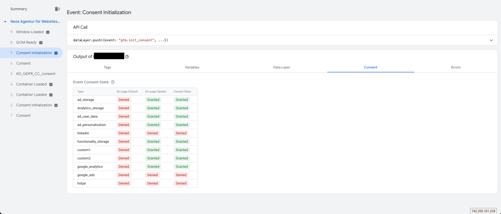

# KaufmannDigital.GDPR.UserManagement
(Sorry for screenshots in german. Tag-Manager ignored the browser-settings for language while creating them. Feel free to contribute some in english language.)
## Use Google Tag-Manager's Consent-Mode

### 1. Enable Consent-Mode in Tag-Manager. 
Consent mode is currently (Q1/2024) still a beta feature, but it works perfectly. However, the feature must be activated once for the tag container. This is simply done via the settings in the Tag Manager login:

(this step may no longer be necessary after the beta phase)
### 2. Configure needed consents in relevant tags
The consent must then be configured in the relevant tags. For tags from Google's templates, Google already provides its own consents. These can be supplemented with your own consents:  
  
For individual tags, only the individual consent is available and must be configured accordingly.

"Consent Initialization" (exists as a template) can then be used as a trigger for the tags. If required, this can be extended to include further conditions (such as URL match):  

### 3. Configure Consents in Neos
GTM clients can also be configured in the cookie or cookie group inspector. Settings for this can be found both in the groups and in the individual cookies.
First, the consents specified by Google can be selected. You can then activate your own consents in the field below.  
  
All consents that are configured in Neos are assigned the status "denied" by default. After the user has made a decision, the corresponding consents are updated and overwritten with the user decision.

### 4. Test via Tag-Manager
The preview mode in the Tag Manager can be used to test whether everything is working. Information about the status of the consents is now available here. You can also see why individual tags have not been fired.  
  

## React to a custom event (also supported with alternative Tag-Managers or other tools)
Only a few configurations are necessary to use the Tag Manager. The necessary steps are described in detail below.

### 1. Create custom variable
First we have to create a custom datalayer-variable to check which cookies are accepted by the user.  
Logged in to Tag Manger, click on "Variables" and select "New" under "Userdefined variables".

Give the variable a recognizable name and select "Datalayer variable" as type.

Now add `KD_GDPR_CC.consents` as path for the variable and save the new variable.

### 2. Create custom event trigger
Now we have to create a new trigger listening to the event, which is triggered by the package.  
To do so, switch to the "Trigger"-Menu and add a new one.  

As type we have to select the "userdefined event".

Now we have to configure the trigger. As name we can use `KD_GDPR_CC_consent`.  
The trigger should only be triggered, if the variable `CookieConsent` (configured in step 1) should `contain` the identifier configured in the Neos Backend. In this example `google-analytics`.

Don't forget to save your changes 🙂

### 3. Add trigger to existing Tags
As last step, we only have to remove other triggers from our existing Tags and add the just created one.  

After testing and publishing changes, we are done 🎉   
You can repeat Step 2 and 3 for other Cookies and Groups you defined, if needed. The variable in step 1 can be reused in all triggers.
