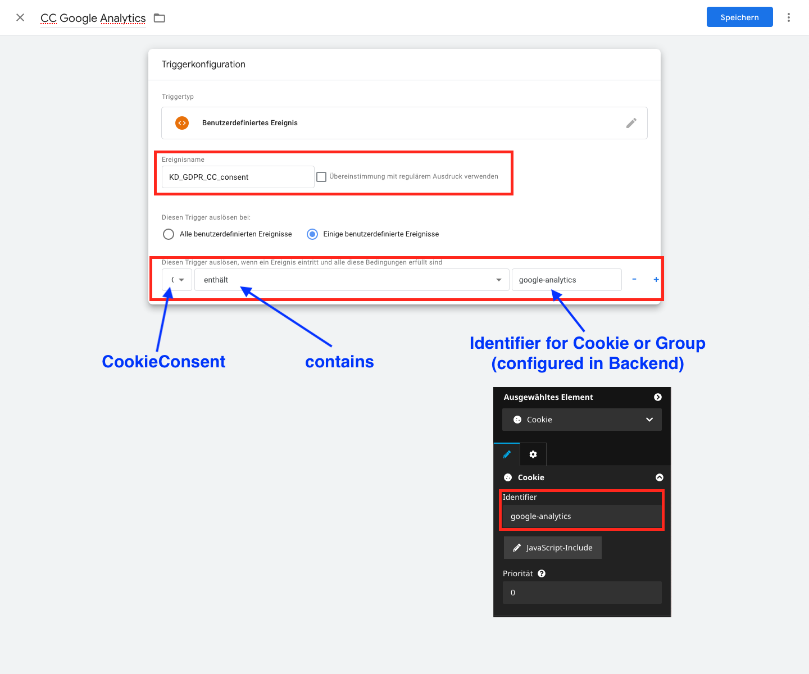

# KaufmannDigital.GDPR.UserManagement
## React to User-Decision using Google Tag Manager
Only a few configurations are necessary to use the Tag Manager. The necessary steps are described in detail below.

### 1. Create custom variable
First we have to create a custom datalayer-variable to check which cookies are accepted by the user.  
Logged in to Tag Manger, click on "Variables" and select "New" under "Userdefined variables".

Give the variable a recognizable name and select "Datalayer variable" as type.

Now add `KD_GDPR_CC.consents` as path for the variable and save the new variable.

### 2. Create custom event trigger
Now we have to create a new trigger listening to the event, which is triggered by the package.  
To do so, switch to the "Trigger"-Menu and add a new one.  

As type we have to select the "userdefined event".

Now we have to configure the trigger. As name we can use `KD_GDPR_CC_consent`.  
The trigger should only be triggered, if the variable `CookieConsent` (configured in step 1) should `contain` the identifier configured in the Neos Backend. In this example `google-analytics`.

Don't forget to save your changes 🙂

### 3. Add trigger to existing Tags
As last step, we only have to remove other triggers from our existing Tags and add the just created one.  

After testing and publishing changes, we are done 🎉   
You can repeat Step 2 and 3 for other Cookies and Groups you defined, if needed. The variable in step 1 can be reused in all triggers.
