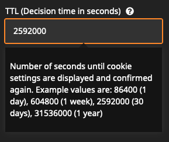

# KaufmannDigital.GDPR.CookieConsent
A ready-to-run package, that integrates an advanced cookie consent banner into your Neos CMS site.  
This is a further development of our previous [cookie consent package](https://github.com/KaufmannDigital/KaufmannDigital.CookieConsent). Through the individual configuration per service (cookie), this package is a perfect basis for creating GDPR compliant websites.

## Versions
This package is available in multiple Version. Here you can check compatibility and maintenance-state.
Composer-Version | Neos-Compatibility | Maintenance
-----------------| -------------------|-------------|
`^1.0` | < 5.0  | ⛔
`^2.0` | >= 5.0 | 🐛
`^3.0` | >= 5.0 | 🐛 ✨
`^4.0` | >= 5.0 | 🐛 ✨

## Installation
It's easier than you probably think!  
Just run `composer require kaufmanndigital/gdpr-cookieconsent` (or require one of the versions from above)

After the installation it's necessary to run doctrine migrations: `./flow doctrine:migrate`

## Configuration
Since this package is ready-to-run, you can configure your cookie banner in just a few Steps.

1. Create a new **Cookie-Settings Page** (shipped inside the Package) somewhere inside your Site-Tree.
2. Switch to the newly created page and edit the cookie banner contents to your wishes.
3. Add cookie-groups and cookies to the banner.  

### Consent per dimension
If you've configured one or multiple dimensions in Neos and you need to save different consents per dimension(-combination), you can just configure it using Settings.yaml: 
```yaml
KaufmannDigital:
  GDPR:
    CookieConsent:
      consentDimensions:
        - country
```
This examples would save different consents per country for each user. This means, that the user will see the CookieConsent again the first time, he switches to another country.  
It also influences the [way the content is stored in the cookie](#read-cookie-identifiers-from-cookie). Instead of a key `"default" there are now multiple entries within `"consents"` for each dimension(-combination). A short example: 
```json
{
  "consents": {
    "deu": [
      "necessary",
      "analytics",
      "marketing"
    ],
    "dnk": [
      "necessary",
      "analytics",
      "marketing"
    ]
  },
  "consentDate": "Tue, 11 Feb 2020 11:35:23 GMT",
  "expireDate": "Wed, 10 Feb 2021 23:00:00 GMT"
}
```
If you configured multiple dimensions in `consentDimensions`, they get connected here using underscores. Example: `deu_de`

### React to the user's cookie decision
You can use one of these Methods to react on the user's decision on which Cookies are accepted:

#### Load JavaScript dynamically
You can paste your JavaScript-Code while adding Cookies to the banner. The package will evaluate the user's decision and merge the required JavaScript dynamically for each user on the fly.
You don't have to take care of anything. JavaScript gets loaded completely automatic. Cool, isn't it? 😎  
*Ah! And don't worry about performance. All JS gets minified and cached for every single visitor individually.*


#### Read cookie-identifiers from cookie
If you are already using another way to include your JavaScript, you can depend on the value of the Choice-Cookie.  
It's named `KD_GDPR_CC` and contains all identifiers of groups and cookies you defined in Backend while configuration. The payload of that cookie could look like this:
```json
{
  "consents": {
    "default": [
      "necessary",
      "analytics",
      "marketing"
    ]
  },
  "consentDate": "Tue, 11 Feb 2020 11:35:23 GMT",
  "expireDate": "Wed, 10 Feb 2021 23:00:00 GMT"
}
```
*If you configured [Consent per Dimensions](#consent-per-dimension), there are entries per dimension in `"consents"`, instead of default. [See example](#consent-per-dimension).*

So just check *consents* and load the needed JavaScript.  
*Pro-Tip: If you are using Google Tag Manager to add your JS-Tags, you can define a custom datalayer-variable of type `First-Party-Cookie`, which can be used as condition inside triggers then.*

#### React to datalayer event in Google Tag Manager
In order to react to the user's decision in the Google Tag Manager, not much is needed. You can easily listen to an custom event. [We provided a full Guide here.](Documentation/GoogleTagManager.md)


#### Add a Re-open link
To create a link for reopening the banner, you only have to place a link with `#GDPR-CC-open-settings` as target:
```html
<a href="#GDPR-CC-open-settings">Cookie-Settings</a>
```
After clicking on such a link, the cookie-banner will be loaded via API. Old settings are used as presets.

#### Custom cookie name
In some usecases it's needed to change the name of the Configuration-Cookie. That can easily be archived by using the following Setting: 
```yaml
KaufmannDigital:
  GDPR:
    CookieConsent:
      cookieName: 'CUSTOM_COOKIENAME'
```

#### Versioning
In some cases, it may be necessary to show the cookie-banner to people who have actually already accepted it. For example, if a new cookie has been added.  
To do this, you only need to edit the version date. You can find it in the inspector of the cookie-settings NodeType:   
  

After the date has been changed, the banner will be shown again to all visitors, who have submitted the cookie banner before this date. Old settings are used as presets.


#### Invalidating user-decisions after time
Sometimes it is necessary or advantageous to remind the user of his decision and ask him to confirm it again. For this purpose, a TTL for the decision can be set in the backend:  
  
The unit is seconds. After the set time has expired, the banner appears again with the default settings of the last decision, so the user can easily accept the old decision with just one click.  
The value `0` (default) disables the repeated display of the banner.
### Styling
#### Custom Banner-Styles
The banner comes with a few basic-styles for positioning, which are getting included inline. To add your custom styles, just put a CSS-Files somewhere in your Resources-Folder and include it using Settings.yaml:   
```yaml
KaufmannDigital:
  GDPR:
    CookieConsent:
      customCSSFilepath: 'resource://Vendor.Package/Private/Styles/cookie-consent.css' #You can also use the public-path, of course
```
To get an idea of the CSS-styling and class-names, you can have a look [into our SCSS](Resources/Private/Styles/Main.scss).  

#### Site-Styles on Cookie-Page
If you rely on your Site-Package Styles inside of the banner, you can just include them into the (otherwise unstyled) Cookie-Page for configuring the banner inside the Backend. To do so, just add it to your Settings:
```yaml
KaufmannDigital:
  GDPR:
    CookieConsent:
      siteCSSFilepath: 'resource://Vendor.Package/Public/Stylesheets/Site.css'
```

#### Site specific Styling
If you manage multiple sites in your Neos installation, you can specify cookie banner styles for each site.
```yaml
KaufmannDigital:
  GDPR:
    CookieConsent:
      siteCSSFilepath: 'resource://Vendor.Package/Public/Stylesheets/Site.css'
      customCSSFilepath: 'resource://Vendor.Package/Public/Stylesheets/CookieBanner.css'
      siteStyles:
        "siteNameOne": # the sites rootNode name
          siteCSSFilepath: 'resource://Vendor.Package/Public/Stylesheets/SiteSpecific.css' # overwrites siteCSSFilepath for this site
          customCSSFilepath: 'resource://Vendor.Package/Public/Stylesheets/SiteCookieBanner.css' # overwrites customCSSFilepath for this site
```
*Hint: We are working on advanced styling options. Different style- and positioning presets will be available in future. If you have any wishes or created a cool design for this banner yourself, please contact us.*

### Consent Logging
The package provides the ability to track the users decisions by storing the chosen consent identifiers along with a random user id and the user agent in your database. This feature is disabled by default, you can enable it in your Settings.yaml:
```yaml
KaufmannDigital:
  GDPR:
    CookieConsent:
      consentLogEnabled: true
```

## Roadmap / Planned Features

* Presets for popular cookies. For example:
  * Google Analytics
  * Matomo (Piwik)
  * Intercom Support-Chat
  * ...

* Adjustable CI/Colors inside the Backend


## Sponsors
We would like to thank our sponsors, who supported us financially during the development:  

[](https://www.mittwald.de/?utm_source=github&utm_medium=banner&utm_campaign=cookie-consent-manager-package)


Are you missing a feature in our solution? You wan't to support the development of this Package? Please don't hesitate to contact us!  
Email: [support@kaufmann.digital](mailto:support@kaufmann.digital)


## Maintainer

This package is maintained by the [Neos Agency Kaufmann Digital](https://www.kaufmann.digital).  
Feel free to send us your questions or requests to [support@kaufmann.digital](mailto:support@kaufmann.digital)

### Issues and Pull-Requests are welcome!
You got stuck while installing or configuring? You are missing something? You found a bug?  
No problem, just create an issue or open a pull request. We'll have a look at it ASAP.

## License

Licensed under GPL-3, see [LICENSE](LICENSE)
