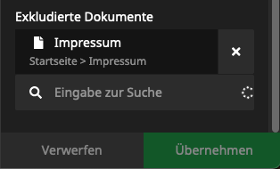

# KaufmannDigital.GDPR.CookieConsent
A ready-to-run package, that integrates an advanced cookie consent banner into your Neos CMS site.  
This is a further development of our previous [cookie consent package](https://github.com/KaufmannDigital/KaufmannDigital.CookieConsent). Through the individual configuration per service (cookie), this package is a perfect basis for creating GDPR compliant websites.


## Versions

This package is available in multiple Version. Here you can check compatibility and maintenance-state.
Composer-Version | Neos-Compatibility | Maintenance
-----------------| -------------------|-------------
`^1.0` | < 5.0  | ⛔
`^2.0` | >= 5.0 | ⛔
`^3.0` | >= 5.0 | ⛔
`^4.0` | >= 5.0 | 🐛 
`^5.0` | >= 5.0 | 🐛 ✨ (⚠️ [Note changed rendering and Styling](#styling))


## Installation

It's easier than you probably think!  
Just run `composer require kaufmanndigital/gdpr-cookieconsent` (or require one of the versions from above)

After the installation it's necessary to run doctrine migrations: `./flow doctrine:migrate`


## Configuration

Since this package is ready-to-run, you can configure your cookie banner in just a few Steps.

1. Create a new **Cookie-Settings Page** (shipped inside the Package) somewhere inside your Site-Tree.
2. Switch to the newly created page and edit the cookie banner contents to your wishes.
3. Add cookie-groups and cookies to the banner.  


### Consent per dimension

If you've configured one or multiple dimensions in Neos and you need to save different consents per dimension(-combination), you can just configure it using Settings.yaml: 
```yaml
KaufmannDigital:
  GDPR:
    CookieConsent:
      consentDimensions:
        - country
```
This example would save different consents per country for each user. This means, the user will see the CookieConsent again the first time he switches to another country.  
It also influences the [way the content is stored in the cookie](#read-cookie-identifiers-from-cookie). Instead of a key `"default" there are now multiple entries within `"consents"` for each dimension(-combination). A short example: 
```json
{
  "consents": {
    "deu": [
      "necessary",
      "analytics",
      "marketing"
    ],
    "dnk": [
      "necessary",
      "analytics",
      "marketing"
    ]
  },
  "consentDate": "Tue, 11 Feb 2020 11:35:23 GMT",
  "expireDate": "Wed, 10 Feb 2021 23:00:00 GMT"
}
```
If you configured multiple dimensions in `consentDimensions`, they get connected here using underscores. Example: `deu_de`


### Exclude special pages (like imprint)

You have 2 options to exclude special pages from displaying the Cookie-Settings. If you have a special NodeType, you want to exclude, you can set it as general rule by Settings.yaml: 
```yaml

KaufmannDigital:
  GDPR:
    CookieConsent:
      excludeDocumentNodeTypes:
        - 'Vendor.Package:Document.Imprint'
```
Alternatively, you can choose all kind of Document-Nodes in the Backend:  



### Show banner after first interaction

For example in SEO-aspects it makes sense to show the banner after users first interaction. You can easily configure the Package to behave like this: 
```yaml
KaufmannDigital:
  GDPR:
    CookieConsent:
      hideBeforeInteraction: true
```


### Auto-Accept necessary cookies

In some cases, you may need to accept necessary cookies without an user-interaction.  For such a case you can easily add the following to your HTML: 
```html
<script>var KD_GDPR_CC_ACCEPT_NECESSARY = true;</script>
```
This makes the Package to auto-accept necessary cookies without showing the consent-window. The user of course can open the window by hand anyways to adjust the decision.   

### Accept by Headers
If you are loading site-contents from other websites or in apps, you already have your needed consent. If so, you can configure Headers, which should accept your consents by default.
```yaml
KaufmannDigital:
  GRDPR:
    CookieConsent:
      headerConsent:
        acceptAll:
          'User-Agent': 'Accepting-All-Agent*'
        acceptNecessary:
          'User-Agent': 'Accepting-needed-Agent*'
```
Here you can use the syntax of [fnmatch()](https://www.php.net/manual/de/function.fnmatch.php) for wildcards or similar.


### Accept by URL-Params
You can also accept all cookies or necessary ones by URL-parameters. See, how to configure:
```yaml
KaufmannDigital:
  GRDPR:
    CookieConsent:
      parameterConsent:
        acceptAll:
          'gdpr': 'accept-all'
        acceptNecessary:
          'gdpr': 'accept-needed'
```
In this example, you can accept all cookies by calling every page you want with param `?gdpr=accept-all` and accept necessary with param `?gdpr=accept-needed`.  
You can also define multiple param/value combinations for each case. 

### React to the user's cookie decision
You can use one of these Methods to react on the user's decision on which Cookies are accepted:


#### Load JavaScript dynamically

You can paste your JavaScript-Code while adding Cookies to the banner. The package will evaluate the user's decision and merge the required JavaScript dynamically for each user on the fly.
You don't have to take care of anything. JavaScript gets loaded completely automatic. Cool, isn't it? 😎  
*Ah! And don't worry about performance. All JS gets minified and cached for every single visitor individually.*


#### Read cookie-identifiers from cookie

If you are already using another way to include your JavaScript, you can depend on the value of the Choice-Cookie.  
It's named `KD_GDPR_CC` and contains all identifiers of groups and cookies you defined in Backend while configuration. The payload of that cookie could look like this:
```json
{
  "consents": {
    "default": [
      "necessary",
      "analytics",
      "marketing"
    ]
  },
  "consentDate": "Tue, 11 Feb 2020 11:35:23 GMT",
  "expireDate": "Wed, 10 Feb 2021 23:00:00 GMT"
}
```
*If you configured [Consent per Dimensions](#consent-per-dimension), there are entries per dimension in `"consents"`, instead of default. [See example](#consent-per-dimension).*

So just check *consents* and load the needed JavaScript.  
*Pro-Tip: If you are using Google Tag Manager to add your JS-Tags, you can define a custom datalayer-variable of type `First-Party-Cookie`, which can be used as condition inside triggers then.*


#### React to datalayer event in Google Tag Manager

In order to react to the user's decision in the Google Tag Manager, not much is needed. You can easily listen to an custom event. [We provided a full Guide here.](Documentation/GoogleTagManager.md)


#### Add a Re-open link

To create a link for reopening the banner, you only have to place a link with `#GDPR-CC-open-settings` as target:
```html
<a href="#GDPR-CC-open-settings">Cookie-Settings</a>
```
After clicking on such a link, the cookie-banner will be loaded via API. Old settings are used as presets.


#### Custom cookie name

In some usecases it's needed to change the name of the Configuration-Cookie. That can easily be archived by using the following Setting: 
```yaml
KaufmannDigital:
  GDPR:
    CookieConsent:
      cookieName: 'CUSTOM_COOKIENAME'
```


#### Versioning

In some cases, it may be necessary to show the cookie-banner to people who have already gave their consent. For example, if a new cookie has been added.  
To do this, you only need to edit the version date. You can find it in the inspector of the cookie-settings NodeType:   
  

After the date has been changed, the banner will be shown again to all visitors, who have submitted the cookie banner before this date. Old settings are used as presets.


#### Invalidating user-decisions after time

Sometimes it is necessary or advantageous to remind the user of his decision and ask him to confirm it again. For this purpose, a TTL for the decision can be set in the backend:  
  
The unit is seconds. After the set time has expired, the banner appears again with the default settings of the last decision, so the user can easily accept the old decision with just one click.  
The value `0` (default) disables the repeated display of the banner.


### Styling

#### Custom Banner-Styles
The banner comes with default styling that aims to be GDPR compliant and accessible.  

You can customise the banner by either:

1. Set a theme color (for buttons), the background color, text color and maximum width of the banner via the input fields in the inspector.
2. Create a CSS-File with your own styling and include it using Settings.yaml:

```yaml
KaufmannDigital:
  GDPR:
    CookieConsent:
      customCSSFilepath: 'resource://Vendor.Package/Private/Styles/cookie-consent.css' #You can also use the public-path, of course
```
To get an idea of the CSS-styling and class-names, you can have a look [into our SCSS](Resources/Private/Styles/Main.scss).  

Instead of writing out all the selectors in your custom file, it might be enough to just overwrite the relevant custom properties. This example file shows the custom properties that can be used:

```css
.gdpr-cookieconsent-container {
    --cookieconsent-theme-color: rgb(0 137 203);
    --cookieconsent-overlay-color: rgb(0 0 0 / .75);
    --cookieconsent-bg-color: rgb(255 255 255 / 0.95);

    --cookieconsent-group-bg-color: rgb(255 255 255);

    --cookieconsent-button-text-color: rgb(255 255 255);
    --cookieconsent-button-primary-color: var(--cookieconsent-theme-color);
    --cookieconsent-button-secondary-color: rgb(255 255 255);
    --cookieconsent-button-primary-text-color: var(--cookieconsent-button-text-color);
    --cookieconsent-button-secondary-text-color: rgb(0 0 0);
    --cookieconsent-button-borderradius: 4px;

    --cookieconsent-spacing: 1rem;
    --cookieconsent-width: 1200px;

    --cookieconsent-focus-outline: black solid 2px;
    --cookieconsent-focus-outline-offset: 2px;
}

/* Switches options */
.gdpr-cookieconsent-switch {
    --cookieconsent-switch-thumb-size: 1.5rem;
    --cookieconsent-switch-thumb-color: rgb(255 255 255);
    --cookieconsent-switch-thumb-highlight-color: rgba(0 0 0 / 0.25);
    --cookieconsent-switch-length: calc(var(--cookieconsent-switch-thumb-size) * 2);
    --cookieconsent-switch-padding: 4px;
    --cookieconsent-switch-inactive-color: rgb(204 204 204);
    --cookieconsent-switch-active-color: var(--cookieconsent-theme-color);
    --cookieconsent-switch-thumb-size-small: 1rem;
    --cookieconsent-switch-outline: var(--cookieconsent-focus-outline);
    --cookieconsent-switch-outline-offset: var(--cookieconsent-focus-outline-offset);
}

```

⚠️ **Please note that colors set in the inspector will overwrite values set in your custom css file. You might need to unset the color values in the inspector first.**


#### Use your own fusion components in the banner

Sometimes adjusting CSS isn't enough, and you just want to use your own button or text components in the banner. Good news: You can by overwriting the `renderer`of the following components:

- `KaufmannDigital.GDPR.CookieConsent:Component.Atom.AcceptAllButton`
- `KaufmannDigital.GDPR.CookieConsent:Component.Atom.SaveButton`
- `KaufmannDigital.GDPR.CookieConsent:Component.Atom.AcceptNecessaryButton`
- `KaufmannDigital.GDPR.CookieConsent:Component.Atom.OpenIndividualSettingsButton`
- `KaufmannDigital.GDPR.CookieConsent:Component.Atom.CloseIndividualSettingsButton`
- `KaufmannDigital.GDPR.CookieConsent:Component.Atom.Headline`
- `KaufmannDigital.GDPR.CookieConsent:Component.Atom.Text`

Accessing the button labels is as easy as accessing `${props.label}`.

Here's an example how to use your own button as the "Accept all" button:

```fusion
prototype(KaufmannDigital.GDPR.CookieConsent:Component.Atom.AcceptAllButton) {
    renderer = Vendor.Site:Component.PrimaryButton {
        myLabel = ${props.label}
    }
}
```


## Roadmap / Planned Features

* Presets for popular cookies. For example:
  * Google Analytics
  * Matomo (Piwik)
  * Intercom Support-Chat
  * ...
  

## Sponsors
We would like to thank our sponsors, who supported us financially during the development:  

[](https://www.mittwald.de/?utm_source=github&utm_medium=banner&utm_campaign=cookie-consent-manager-package)


Are you missing a feature in our solution? You want to support the development of this Package? Please don't hesitate to contact us!  
Email: [support@kaufmann.digital](mailto:support@kaufmann.digital)


## Maintainer

This package is maintained by the [Neos Agency Kaufmann Digital](https://www.kaufmann.digital).  
Feel free to send us your questions or requests to [support@kaufmann.digital](mailto:support@kaufmann.digital)

### Issues and Pull-Requests are welcome!
You got stuck while installing or configuring? You are missing something? You found a bug?  
No problem, just create an issue or open a pull request. We'll have a look at it ASAP.

## License

Licensed under GPL-3, see [LICENSE](LICENSE)
